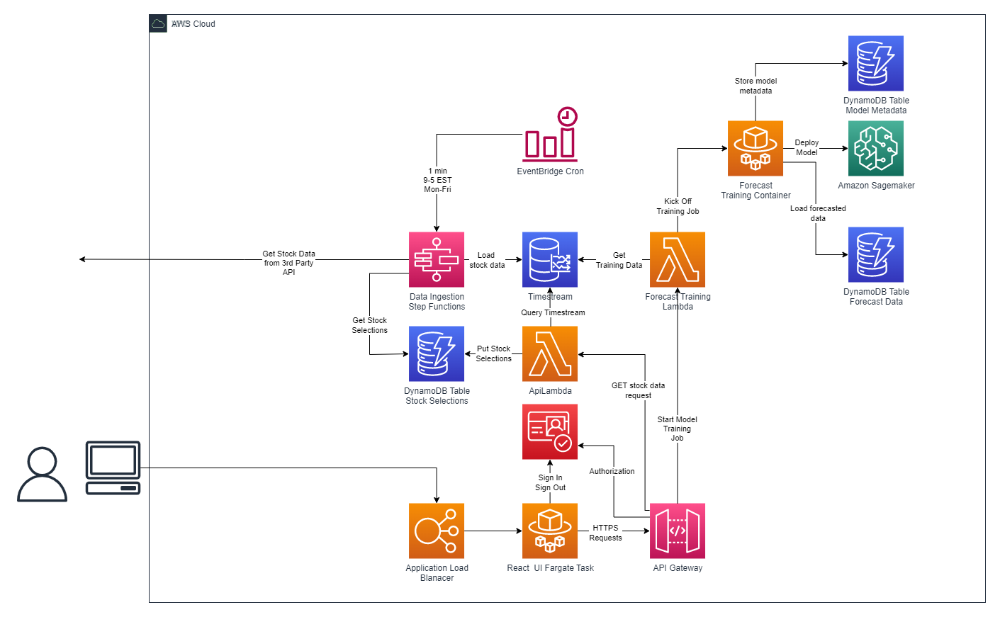

# **NOTE:** NOT COMPLETE
Please note that this project is still a work in progress. As of 11/17/2022 the front end is commented out and the React app is simply the default project. Furthermore plenty of back end work is being done.

# **isWealthy: True, aka iW:T**

This project is to support day trading efforts. It uses machine learning and technical indicators to determine ideal points to buy and sell. The differentiator here is to focus on sub-1% daily growth through trading on microfluctuations such that compound growth may get up to ~500% annual growth.

**TODO** Possibly use anomaly detection to determine anomalies in forecasted values. If values achieve sufficient periodicity and magnitude then the stock becomes a target for buy/sell transactions. The Random Cut Forest machine learning model is based on anomalies being defined as a value being 3 standard deviations from the mean, I'll explore how this might relate to what is typical for blue-chip stocks. 

### **Solution Architecture**

 

### **API**

| Methods | Resource Path | Description |
|---------|---------------|-------------|
|    GET  |    /stocks    | retrieve NASDAQ stock metadata from the exchange |
|    GET  |  /stocks/{ticker} | retrieve specific stock based on ticker symbol |
|    GET  |  /stocks/{ticker}/price | Retrieve most recent real-time price for a single stock |
|    GET  |  /stocks/{ticker}/price?interval=#&numOfIntervals=# | Retrieves historical data based on interval* and quantity of data points |
|    POST  |  /stocks/{ticker}/price?interval=#&numOfIntervals=# | Store historical data for stock in Amazon Timestream |
|    POST  |  /forecasts/{ticker} | Kick off forecast training job NOTE: Might need to add query params for forecast horizon and stock data history span |

> **__NOTE:__** *interval* is the OHLC segment or bar to be retrieved; 1min, 5min, 15min, 30min, 45min, 1h, 2h, 4h, 1day, 1week, 1month. *numOfIntervals* is the quantity of the OHLC bars to be retrieved; i.e., interval of 5 minutes, with quantity of 10, will retrieve 10 of the most recent 5 minute segments

### **Sagemaker**

I'll be using Amazon Sagemaker to deploy serverless endpoints. Serverless endpoints have the benefits of:

1. No cost when not in use
2. Handles cold starts well
3. Reduces complexity for future devs to mitigate decisions on instance types

Furthermore, Amazon Sagemaker provides native functionality for development of this solution by providing native internal endpoints to reduce latency
and improve security.

### **Timestream**

Amazon Timestream scales to trillions of devices for IoT and is the standard database in AWS to be used for time series data.
Amazon Timestream will be used for the ingestion of historical data. Amazon Timestream has two caveats:
1. The historical data's timestamp can not be prior to the length of time set for the retention period
2. When handling forecasting data points, Amazon Timestream only allows for a few hours into the future

### **DynamoDB**

Amazon DynamoDB is a Key-Value/NoSQL serverless data store. We will be using it to store metadata about the forecast models produced for referencing calculated datapoints as well as for housing all forecasts values. Extensibility exists on Amazon DynamoDB as there is DynamoDB Streams. DynamoDB Streams creates an event when data is stored. This forecasted values can push these events into a an SQSQueue for aggregated and processing by a Lambda function. Should it meet certain requirements a transaction can be made.

### **Fargate**

Containerization of applications and services is a modern and simplistic approach to microservices architectural design patterns. This solution will use Fargate, the serverless container service in AWS, to house a React front-end. Further, due to the duration of Amazon Sagemaker training jobs, a fargate "one-off" task will be utilized each time a training job is requested.

### **EventBridge (Cron)**

EventBridge, previously known as CloudWatch, has the capability to create rate or cron like events to activate other services. To continuously update our stock data, a cron job will be ran every 5 minutes, between the hours of 0900 - 1700 hours EST, Monday through Friday. This will pull the API from an SSM Parameter Store location and use this to make a request to the third part vendor of stock data. Setting up the API key is a manual task that needs to be done independant of the deployment of this solution.

 

API Key Parameter Store Name: 'twelve-data-api-key'
 
Website to vendor: https://rapidapi.com/twelvedata/api/twelve-data1

## **Useful commands**

* `cdk deploy --all`      deploy this stack to your default AWS account/region
* `cdk diff`        compare deployed stack with current state
* `cdk synth`       emits the synthesized CloudFormation template
* `npm run build`   compile typescript to js
* `npm run watch`   watch for changes and compile
* `npm run test`    perform the jest unit tests

The `cdk.json` file tells the CDK Toolkit how to execute your app.

